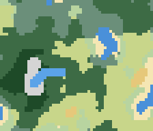
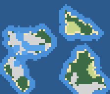
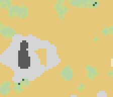
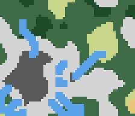
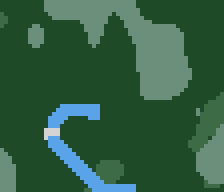
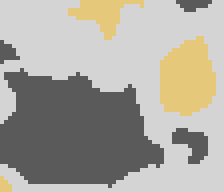
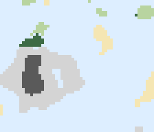
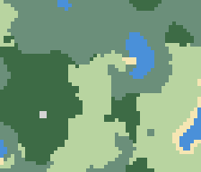
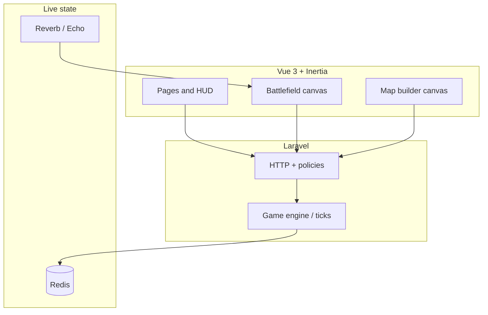

<p align="center">
  
</p>

<h1 align="center">Clash of Dots</h1>

<p align="center">
  <strong>Plan like a diagram. Fight like an RTS.</strong><br />
  <strong>Clash of Dots</strong> is a server-authoritative multiplayer strategy game - tactical canvas,
  procedural battlefields, and a <strong>Map Builder</strong> you can publish to the community. Gameplay
  is inspired by the classic browser RTS
  <a href="https://warofdots.net/">War of Dots</a>.
</p>

<p align="center">
  <a href="https://github.com/tmwclaxton/clashofdots"></a>
  <a href="https://laravel.com"></a>
  <a href="https://vuejs.org"></a>
  <a href="https://inertiajs.com"></a>
  <a href="https://tailwindcss.com"></a>
</p>

<p align="center">
  
  
  
  
  
</p>

---

## Game Wiki

The in-app **Game Wiki** (`/wiki`) is the live reference for balance and map rules. Every number on the page is served from **`App\Game\GameSpecs`** on the backend—the same source the engine and Map Builder draw from, not hand-maintained copy in Vue.

| Section | What it covers |
|--------|----------------|
| **Combat units** | Infantry vs tank—health, recruit cost, upkeep, defense, and role summaries |
| **Settlements & economy** | Capitals and outposts (income, supply caps, healing), plus economy notes on income, upkeep, supply, recruitment, and encirclement |
| **Terrain types** | All 13 editor terrains with color swatches, infantry/tank speed & attack stats, and tactical notes |
| **Map generation styles** | Mixed, Islands, Desert, Mountains, Jungle, Volcanic, Tundra, and Grassland—traits, descriptions, and deterministic preview renders |

Open the wiki from the landing page header, the app top bar, or directly at `/wiki` once the app is running. The Map Builder card at the top links straight into authoring.

Wiki and README preview images live under `public/images/wiki/` (terrain swatches and map-generation renders) and can be regenerated with `npm run wiki:map-previews`.

### Terrain palette

Thirteen brush types paint the vertex grid in the Map Builder and appear on the wiki terrain table. Swatches match the in-game editor colors.

<div align="center">

<table>
  <tr>
    <td align="center" width="25%">
      <br />
      <strong>Plains</strong><br />
      <sub>Open grassland</sub>
    </td>
    <td align="center" width="25%">
      <br />
      <strong>Meadow</strong><br />
      <sub>Soft rolling grass</sub>
    </td>
    <td align="center" width="25%">
      <br />
      <strong>Forest</strong><br />
      <sub>Light woodland</sub>
    </td>
    <td align="center" width="25%">
      <br />
      <strong>Dense forest</strong><br />
      <sub>Thick woodland</sub>
    </td>
  </tr>
  <tr>
    <td align="center">
      <br />
      <strong>Hill</strong><br />
      <sub>High ground</sub>
    </td>
    <td align="center">
      <br />
      <strong>Mountain</strong><br />
      <sub>Impassable</sub>
    </td>
    <td align="center">
      <br />
      <strong>Desert</strong><br />
      <sub>Tank-friendly dunes</sub>
    </td>
    <td align="center">
      <br />
      <strong>Beach</strong><br />
      <sub>Coastal sand</sub>
    </td>
  </tr>
  <tr>
    <td align="center">
      <br />
      <strong>Water</strong><br />
      <sub>Shallow · damage over time</sub>
    </td>
    <td align="center">
      <br />
      <strong>Deep water</strong><br />
      <sub>Ocean · heavy penalties</sub>
    </td>
    <td align="center">
      <br />
      <strong>River</strong><br />
      <sub>Narrow chokepoints</sub>
    </td>
    <td align="center">
      <br />
      <strong>Swamp</strong><br />
      <sub>Boggy wetland</sub>
    </td>
  </tr>
  <tr>
    <td align="center">
      <br />
      <strong>Snow</strong><br />
      <sub>Frozen tundra</sub>
    </td>
    <td colspan="3" />
  </tr>
</table>

</div>

Infantry generally keeps speed in forests and hills; tanks excel on plains, desert, and beach but bog down in woodland, water, and snow. Snow slows all units and chills attack output—tanks are hit hardest. Full speed, attack, and defense multipliers for every tile are on the wiki terrain table.

### Win conditions

#### Free-for-all (no teams)

A player wins when **both** of the following are true at the same time:

1. They own **all enemy capitals** — every opposing headquarters has been captured.
2. They control **≥ 80 %** of all cities on the map (the `VICTORY_CITY_THRESHOLD`).

The engine checks this every tick. The match ends immediately when the condition is met.

#### Team mode

When players are assigned to teams the conditions adjust:

1. All players on the **opposing side** must have **zero troops and zero cities**.
2. The winning team collectively holds **≥ 80 %** of all cities.

#### No-winner draw

If every commander is inactive (no orders submitted) for **120 seconds** (`MATCH_ALL_PLAYERS_INACTIVE_SECONDS`) the match is ended without a winner.

---

### Economy — credits & income

Each commander has a credit balance tracked in Redis alongside the simulation state.

| Constant | Value | Description |
|----------|-------|-------------|
| Starting credits | 220 | Credits each commander begins the match with |
| Income per owned city per tick | 1 credit | Earned every 30 Hz tick for every flag or capital you hold |
| Infantry recruit cost | 200 credits | One-time cost; deducted immediately |
| Tank recruit cost | 400 credits | One-time cost; deducted immediately |
| Army cap | 24 units | Hard upper limit per player across auto-spawns + manual recruits |

**Income math:** at 30 Hz, 1 credit/tick/city ≈ **30 credits/second** per owned city (e.g. 3 cities → 90 credits/s). Holding more cities snowballs income quickly.

There is **no upkeep mechanic** deducting credits per tick — the wiki describes upkeep as a narrative concept inherited from War of Dots community guides, but the engine has no recurring per-unit credit drain. Instead, oversized armies are punished via **supply starvation** (see below).

---

### Auto-spawn (city production)

Every city owned by a player acts as a production facility that auto-spawns troops over time — no player action needed. The spawn formula:

```
baseThreshold = 45 × (30 × troopsPerCity)
adjustedThreshold = baseThreshold × productionSpeedMultiplier
```

`troopsPerCity` is `(total own troops) / (owned cities)`. A city spawns a troop when its internal timer reaches `adjustedThreshold`, then resets. This naturally slows spawn rate as you accumulate troops and speeds it up when you are behind.

- The production type (infantry / tank / none) can be set per city via the HUD.
- A **tank ratio** (0–100) controls the probability a spawned unit is a tank vs infantry.
- Captures reset a city's timer to 0.
- Auto-spawns respect the 24-unit army cap.

---

### Manual recruitment

You can bypass the auto-spawn queue and instantly place a unit near your **capital** for a credit cost:

- **Infantry** — 200 credits. Requires: own capital controlled, army below cap, credits available, and a clear spawn point within 22 world units of the capital.
- **Tank** — 400 credits. Same requirements.

Newly recruited units spawn adjacent to the capital with any rally path the capital already has assigned.

---

### Supply & starvation

Each owned city supplies **5 units** (`CITY_SUPPLY_CAP`). If your army exceeds `ownedCities × 5` the most recently spawned excess units lose **1 HP per tick** (starvation damage). Losing cities mid-battle can suddenly push you over the cap and start bleeding your newest units — capture more cities or let some troops die.

---

### Combat & morale

Units fight automatically when within **32 world units** of an enemy (`TROOP_COMBAT_RANGE`).

| Mechanic | Detail |
|----------|--------|
| **Base attack** | Terrain-dependent (see wiki terrain table); infantry baseline 0.08, tank up to 2.0 on plains |
| **Warmup bonus** | Fresh units get up to **1.45× attack** for the first 120 ticks (~4 s), decaying linearly |
| **Morale** | Ranges 15–100. Drains **0.35/tick** in combat and **0.5/tick** when supply-cut in enemy territory. Recovers **0.22/tick** when resting in own territory. Low morale directly reduces attack power (capped at 0.25× floor) |
| **Healing** | 1 HP/tick when in own territory and not in combat; suppressed during active fighting |
| **Mountains** | Impassable — no unit can enter; attack multiplier 0 |

---

### Planning & executing orders

Clash of Dots uses a **draw-then-commit** order system. Nothing moves until you press **Space**; you can revise paths freely before committing.

#### Drawing paths

| Action | What happens |
|--------|-------------|
| **Click + drag from a unit** | Begins a movement path for that troop or city rally point. Drag to the destination and release. |
| **Re-drag the same unit** | Replaces its existing draft path. |
| **Click + drag on empty ground** | Draws a lasso rectangle. All own troops inside are selected as a group. |
| **Drag from any selected troop** | Extends draft paths for every troop in the group simultaneously. |
| **Right-click + drag** (or two-finger drag on touch) | Pans the camera without affecting drafts. |
| **Scroll / pinch** | Zooms. |

Drafted paths are shown as coloured lines from each unit to its destination. The path is stored locally in the `draftStore` — it has **not** reached the server yet.

#### Committing orders

| Input | Effect |
|-------|--------|
| **Space** | Submits all drafted paths to the server via `POST /games/{uuid}/orders`. Paths are cleared from the draft store on success. |
| **C** | Clears all local drafts without submitting anything. |
| **S** | Halts all own troops immediately — sends an empty-path order for every unit you own. |

#### What happens on the server

1. `SubmitOrdersRequest` validates the payload (path point arrays, optional water-mode strings).
2. `GameManager::submitOrders` merges the incoming orders with any previously stored orders for that player in Redis — a second submit for the same troop *replaces* that troop's path.
3. The merged paths are written back to Redis without running any simulation.
4. The `game:tick --daemon` process (running at **30 Hz**) picks up the new paths on the next tick, advances the simulation, and broadcasts a `GameStateUpdated` event via **Reverb**.

#### Seeing the result

The Vue canvas receives state in two ways:

- **Reverb / Echo push** — `GameStateUpdated` events arrive in ~33 ms for the lowest latency.
- **HTTP snapshot polling** — if WebSockets are unavailable the canvas polls `GET /games/{uuid}/snapshot` every ~1.8 s as a fallback.

Both paths call `applySnapshotPayload` in `gameStore`, which updates the Pinia state and triggers the RAF render loop to redraw troop positions, paths, health bars, and territory.

### Water crossing — Wade vs Embark

Whenever a drafted path crosses **water**, **river**, or **deep water** tiles a modal prompts you to pick a crossing mode before the orders are submitted.

| Mode | How it works | HP drain | Deep water | Visual cue |
|------|-------------|----------|-----------|------------|
| **Wade** | Unit moves through water immediately as a normal troop | 1 HP / tick while in water | Blocked — troops are halted at the deep-water boundary | None |
| **Embark** | Unit pauses at the shore for ~3 s (90 ticks) while converting to a ship | No drain once converted; damage applies during the conversion window | Accessible — ships can cross deep water freely | Pulsing dashed ring during conversion; pointed-oval (boat) hull once converted |

Ships revert to troops the moment they step back onto dry land, resetting the `waterTicks` counter and `isShip` flag.

**Tactical summary:** Use **Wade** for short river crossings where speed matters and you can afford the attrition. **Embark** for ocean or deep-water crossings, island-hopping, or any route where you need to keep the unit at full health.

### Map generation previews

Procedural **Map Builder** styles (deterministic previews, same seed). These match the **Map generation styles** section on the wiki.

<table>
  <tr>
    <td align="center" width="50%">
      <strong>Mix</strong><br />
      
    </td>
    <td align="center" width="50%">
      <strong>Islands</strong><br />
      
    </td>
  </tr>
  <tr>
    <td align="center">
      <strong>Desert</strong><br />
      
    </td>
    <td align="center">
      <strong>Mountains</strong><br />
      
    </td>
  </tr>
  <tr>
    <td align="center">
      <strong>Jungle</strong><br />
      
    </td>
    <td align="center">
      <strong>Volcanic</strong><br />
      
    </td>
  </tr>
  <tr>
    <td align="center">
      <strong>Tundra</strong><br />
      
    </td>
    <td align="center">
      <strong>Grassland</strong><br />
      
    </td>
  </tr>
</table>

---

## Why this project

| Pillar | What you get |
|--------|----------------|
| **Visual language** | Flat, diagrammatic battlefields - readable at a glance, inspired by *Historia Civilis*–style maps |
| **Planning loop** | Draw movement and attack paths, commit orders, then resolve - simplified grand-strategy cadence |
| **Fair play** | Game logic on the **Laravel** backend; the Vue canvas is a view, not the source of truth |
| **Community maps** | **Explore** published designs, fork copies into your builder, start lobbies with attribution |

---

## Feature map



- **Lobbies & matches** - create/join games, host flow, match history  
- **Wiki** - live unit, terrain, economy, and map-generation specs at `/wiki` (backed by `GameSpecs`)  
- **Map Builder** - vertex terrain grid, markers, undo/redo, random generate, autosave  
- **Explore** - published maps, likes/dislikes, fork to your library, lobby from a map  
- **Icons** - [Lucide](https://lucide.dev) (tree-shaken per view) + [Font Awesome 7](https://fontawesome.com) (global solid/regular/brands)

---

## Stack at a glance

| Layer | Choices |
|-------|---------|
| **Backend** | Laravel 13, WorkOS auth, policies & form requests |
| **Frontend** | Vue 3, Inertia 3, Vite 8, Tailwind CSS 4, Reka UI primitives |
| **State & UX** | Pinia, VueUse, vue-sonner toasts |
| **Realtime** | Laravel Reverb, Echo, Pusher protocol client |
| **Quality** | PHPUnit, Pint, ESLint 9, Prettier 3, Laravel Wayfinder (typed routes) |

---

## Quick start

### Prerequisites

- PHP **8.3+** with extensions used by this app (including **pcntl** if you run `php artisan reverb:start` on the host), [Composer](https://getcomposer.org/)
- Node **22+** and npm  
- [PostgreSQL](https://www.postgresql.org/) (primary app database; configure `DB_*` in `.env`)
- [Redis](https://redis.io/) (live match state; required for lobbies and matches)
- [Docker](https://www.docker.com/) (recommended for [Laravel Sail](https://laravel.com/docs/sail))

### Install

```bash
git clone https://github.com/tmwclaxton/clashofdots.git
cd clashofdots
composer install
cp .env.example .env
php artisan key:generate
```

Copy **`.env.example` → `.env`** and run `php artisan key:generate`. Defaults match **Sail**: `DB_HOST=pgsql`, `REDIS_HOST=redis`, `REVERB_HOST=reverb`, and `VITE_REVERB_HOST=localhost`. **`compose.yaml`** also injects `REDIS_HOST`, `REVERB_HOST`, and `VITE_REVERB_*` into PHP containers so live matches work after **`./vendor/bin/sail up`** even if an older `.env` still had `127.0.0.1`. Configure **`WORKOS_*`** when you use login. Matches need **Redis**, **Reverb**, and the **`game-tick`** service (all included in Sail). **PHPUnit** uses **in-memory SQLite** (`phpunit.xml`) unless you change it.

**PHP on the host (no Docker):** set `DB_HOST=127.0.0.1`, `REDIS_HOST=127.0.0.1`, `REVERB_HOST=127.0.0.1`, and keep `VITE_REVERB_HOST=localhost` with Reverb’s port published to the host.

**Guests:** you can open **Lobbies**, join with a code, and fight without signing in. The app stores a stable guest UUID in the Laravel session (`wod_guest_key`) so the same browser can use **Ongoing** to return after a disconnect. Creating a lobby and **Past matches** still require login.

### Run with Sail

```bash
cp .env.example .env   # first time only; then: php artisan key:generate (host or sail)
./vendor/bin/sail up -d
./vendor/bin/sail artisan migrate
./vendor/bin/sail npm install
./vendor/bin/sail npm run dev
```

[`compose.yaml`](compose.yaml) brings up **app** (nginx + PHP), **pgsql**, **redis**, **reverb** (port **8080** on the host by default), **`game-tick`** (`php artisan game:tick --daemon`), **queue-worker**, and **scheduler**. Postgres and Redis use **health checks** before the app container is considered ready; PHP services get **`REDIS_HOST=redis`**, **`REVERB_HOST=reverb`**, and **`VITE_REVERB_HOST=localhost`** so Redis, server-side broadcasting, and Vite all resolve correctly inside Docker.

Open **`APP_URL`** (often `http://localhost` with `APP_PORT=80`).

If **`reverb`** keeps **Restarting** (`./vendor/bin/sail ps`), read `./vendor/bin/sail logs reverb`. Often the Sail **image is stale** (PHP without **pcntl**): run `./vendor/bin/sail build` then `./vendor/bin/sail up -d`. Check with `./vendor/bin/sail exec laravel.test php -r "var_export(extension_loaded('pcntl'));"` — expect `true`.

Rebuild the image after Dockerfile changes: `./vendor/bin/sail build --no-cache`.

### Run without Sail

```bash
php artisan migrate
npm install
composer run dev
```

`composer run dev` runs the HTTP server, queue worker, logs, Vite, **Reverb**, and **`game:tick --daemon`** together. Ensure **Redis** is running and `REDIS_*` in `.env` points at it.

### Live match checklist (troops must move)

Submitted orders are stored in **Redis**, but **units only advance when `php artisan game:tick --daemon` is running** (included in Sail’s `game-tick` service and `composer run dev`). If troops never move after you press **Space**:

1. **Redis** — `REDIS_*` must match a running instance (Sail: `redis` host).
2. **Tick worker** — start `game:tick` or use `composer run dev` / full Sail stack. If `worldTick` never moves, run `./vendor/bin/sail logs game-tick --tail 50`: a failing **lobby expiry** DB query used to abort the whole daemon before ticks ran; that is now isolated, and **`compose.yaml` injects `DB_HOST=pgsql`** into PHP workers so Postgres resolves on the Sail network. The tick loop also **re-syncs `games:active` from the database** periodically so matches are not stuck if Redis dropped the set. **Without the daemon**, the first JSON snapshot in each poll cycle can still advance the sim by **one tick** (heartbeat key `games:tick:daemon-heartbeat` is absent), so the HUD is not stuck at 0; for real-time play you still want `game:tick --daemon` at full tick rate.
3. **Reverb** — optional for movement; the play page still **polls JSON snapshots every ~1.8s** so you see positions without websockets. Reverb adds lower-latency `GameStateUpdated` pushes.

Regression: `php artisan test tests/Feature/Games/GameTickOrdersTest.php` (requires Redis; skipped otherwise). Inspect tick registration: `./vendor/bin/sail artisan game:active-set` (add `--repair` to re-sync from the DB). **Raw `redis-cli SMEMBERS games:active` is often empty** because Laravel prefixes keys with `slug(APP_NAME)-database-`; use the command output or `redis-cli KEYS "*games:active*"`. **Match snapshots must not be cached** — if the HUD still claims time is frozen after Redis looks healthy, hard-refresh the play page once (we send `Cache-Control: no-store` on `/games/{game}/snapshot` and `fetch(..., { cache: 'no-store' })` in the client).

If you prefer to run pieces yourself:

```bash
php artisan serve
npm run dev
php artisan reverb:start
php artisan game:tick --daemon
```

---

## Production deploy

CI builds the **`Dockerfile`**, pushes **`ghcr.io/<lowercase github.repository>:latest`**, then SSHs to your host, uploads **`compose.prod.yaml`** into `DEPLOY_DIR`, and runs **`docker compose pull`**, **`up -d`**, and **`php artisan migrate --force`**. SSH uses **Cloudflare Access** (`cloudflared access ssh`) when `CF_ACCESS_CLIENT_*` secrets are set.

### Shared host: only clashofdots

The workflow and compose file are scoped to **project name `clashofdots`** and **`DEPLOY_DIR`** only. It does **not** run host-wide `docker prune` or other commands that would affect other stacks.

When operating manually on a server that runs multiple apps:

- Work only under your **`DEPLOY_DIR`** (e.g. `/opt/clashofdots`).
- Always pass **`-p clashofdots`** and **`-f compose.prod.yaml`** (and **`--env-file .env`**) so Docker Compose never touches another project’s containers or volumes.
- Do not run **`docker volume prune`**, **`docker image prune -a`**, or **`docker system prune`** unless you intend to clean **the whole host**; prefer removing only compose-managed resources for this stack after **`docker compose -p clashofdots … down`**, and only volumes whose names you recognize as belonging to this project.

### Flow

1. **Triggers:** push to `main` or **Actions → Production Deploy → Run workflow**.
2. **Build:** checkout → login to GHCR → `docker build` → `docker push`.
3. **Deploy:** `cloudflared` → SSH key + config (including `ProxyCommand` when using Access) → upload `compose.prod.yaml` → remote `docker login`, `compose pull`, `up -d`, `migrate`.

### Deploy target: **Secrets** or **Variables**

Use **either** the **Secrets** tab **or** the **Variables** tab for `DEPLOY_HOST`, `DEPLOY_USER`, and `DEPLOY_DIR`. If both are set for the same name, the **Secret** value wins.

| Name | Example | Purpose |
|------|---------|---------|
| `DEPLOY_HOST` | `ssh.example.com` | SSH hostname. |
| `DEPLOY_USER` | `deploy` | SSH user. |
| `DEPLOY_DIR` | `/opt/clashofdots` | Remote directory with `.env` and `compose.prod.yaml`. |

Non-sensitive values are fine as **Variables**; using **Secrets** (as in your screenshot) is also valid.

### Other repository **Secrets**

| Secret | Purpose |
|--------|---------|
| `DEPLOY_SSH_PRIVATE_KEY` | Private key for `DEPLOY_USER` on `DEPLOY_HOST`. |
| `CF_ACCESS_CLIENT_ID` / `CF_ACCESS_CLIENT_SECRET` | Optional: Cloudflare Access service token for `cloudflared access ssh`. Omit only if you use plain SSH without Access. |
| `GHCR_TOKEN` | PAT with `read:packages` so the server can **`docker login ghcr.io`** and pull the app image. |

Workflow: [`.github/workflows/prod_deploy.yml`](.github/workflows/prod_deploy.yml).

### One-time server prep

```bash
ssh YOUR_USER@YOUR_HOST
sudo mkdir -p /opt/clashofdots    # same path as DEPLOY_DIR; skip if it already exists
sudo chown YOUR_USER:YOUR_USER /opt/clashofdots
cd /opt/clashofdots
cp /path/to/.env.example .env     # edit: APP_URL, DB_*, WorkOS, Redis, Reverb, etc.
```

The deploy job **does not** create `DEPLOY_DIR`; it only writes `compose.prod.yaml` there. The directory must exist and be writable by `DEPLOY_USER`.

Production `.env` should use **`DB_CONNECTION=pgsql`**, **`DB_HOST=pgsql`**, **`REDIS_HOST=redis`** to match `compose.prod.yaml`. The app is exposed on the host as **`8091` → container `80`** (change **8091** in `compose.prod.yaml` if it conflicts). Reverb is **`${FORWARD_REVERB_PORT:-8092}` → `8080`**. Point `VITE_REVERB_*` (in the built frontend) and public `REVERB_*` at the hostname and port clients use to reach Reverb (often your reverse proxy or host port **8092**). The **`game-tick`** and **`reverb`** services use the same image as `app` and must stay up for live matches.

### After deploy

Point DNS or a reverse proxy at the web port you mapped (default **8091**). Terminate TLS and route WebSocket upgrades to Reverb’s published port when you need live pushes from browsers outside plain `ws://` to the container.

---

## Useful scripts

| Command | Purpose |
|---------|---------|
| `npm run dev` | Vite dev server + HMR |
| `npm run build` | Production frontend build |
| `npm run wiki:map-previews` | Regenerate wiki/README preview SVGs under `public/images/wiki/` |
| `npm run verify:troops` | Sanity-check generated troop layouts |
| `php artisan test --compact` | PHPUnit suite |

---

## Project roots

- **Original game:** [warofdots.net](https://warofdots.net/)  
- **Reference clone (Python):** [gamepycoder/War-of-dots](https://github.com/gamepycoder/War-of-dots)  
- **Visual inspiration:** [Historia Civilis](https://www.youtube.com/c/HistoriaCivilis) (diagram-style battles)

---

## License

This repository is **free to read, fork, modify, and share**, but **not for commercial use or private monetary gain** (including running paid services, selling hosting, or otherwise monetizing a derivative as a product).

The legal terms are the [**PolyForm Noncommercial License 1.0.0**](LICENSE) ([summary](https://polyformproject.org/licenses/noncommercial/1.0.0/)). That keeps the codebase open while barring others from **making money off forks** without a separate agreement from the copyright holders.

> **Note:** The [Open Source Initiative](https://opensource.org/osd) definition of “open source” *includes* the right to use software commercially. So this project is best described as **source-available** or **non-commercial open**, not OSI “Open Source™”. If you need a commercial license, contact the maintainers.
